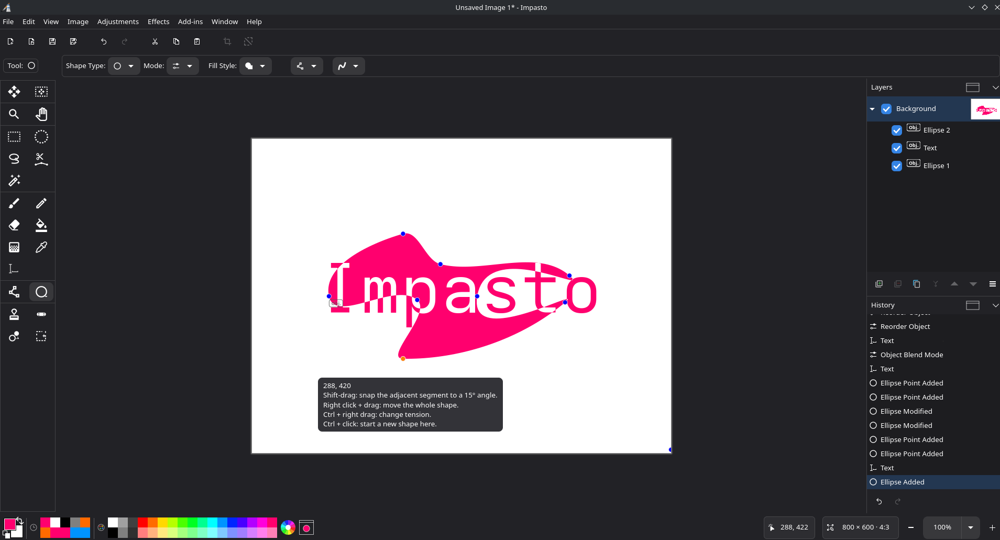
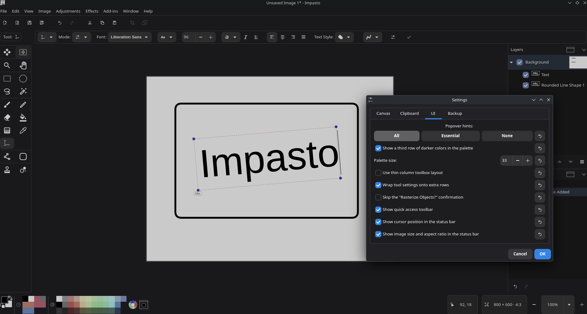
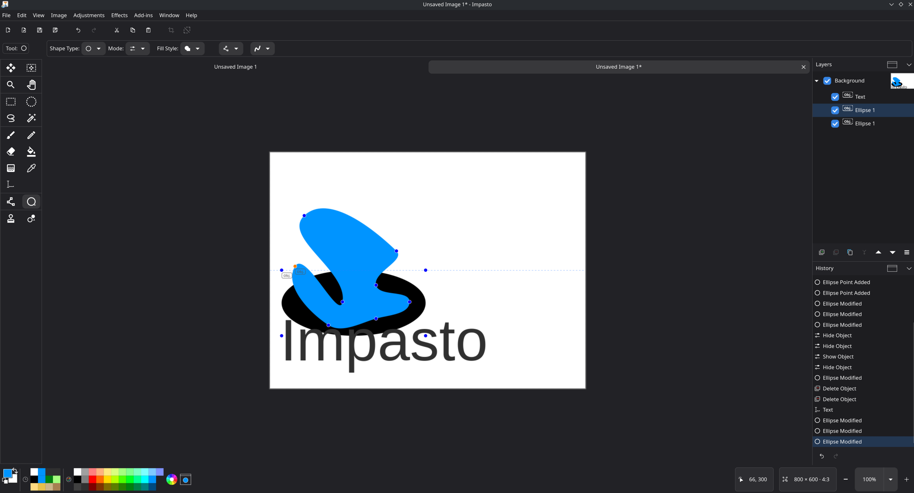

# Impasto

[🇬🇧 English](readme.md) · Traducción automática: se agradecen las correcciones mediante una pull request.

Impasto es una aplicación de pintura y edición de imágenes para Linux, Windows y macOS.

Impasto es ideal para pintar rápidamente, editar imágenes, recortar, cambiar el tamaño y editar por capas.
Usa las herramientas de texto para escribir texto, las herramientas de formas para dibujar líneas libres y las herramientas de selección para copiar y pegar partes de una capa de la imagen.
Mira las capturas de pantalla a continuación.

Imagen destacada: lo que mueves y lo que dibujas se ajusta a la cuadrícula del lienzo, a las unidades de la regla o a los bordes y las líneas centrales del lienzo.

## Descarga

Las compilaciones para Linux, Windows y macOS están en la
[página de lanzamientos](https://github.com/zbcoding/ImpastoPaint/releases/latest). Las compilaciones para Windows y
macOS no están firmadas, por lo que SmartScreen y Gatekeeper mostrarán advertencias.

Impasto necesita GTK 4.18 o posterior, lo que determina qué funciona en Linux:

- **Flatpak**, desde [FlatPark](https://flatpark.org/apps/com.github.zbcoding.Impasto/) o la
  página de lanzamientos. Incluye su propio GTK y funciona en cualquier lugar donde funcione flatpak, incluidos Ubuntu 22.04
  y 24.04. Es la opción recomendada si tienes dudas.
- **AppImage** (`Impasto-x86_64.AppImage`). Incluye GTK, así que no se necesita el GTK del sistema, pero el
  paquete está compilado contra **glibc 2.43** y no arrancará en ninguna versión anterior. Eso significa que
  Ubuntu 26.04, Fedora 44 y Arch funcionan; Ubuntu 24.04, Ubuntu 22.04, Fedora 43 y Debian 13
  no - usa el Flatpak en su lugar.
- **Zip** (`Impasto-linux-dotnet-*.zip`). Usa el GTK que proporciona tu distribución, así que necesita
  tener GTK 4.18+ ya instalado.

Impasto se distribuye bajo la Licencia MIT (consulta `license-mit.txt`). Las
atribuciones, avisos y textos de licencia de terceros están en `THIRD-PARTY-NOTICES.md`.

## Relación con Pinta

Impasto es un proyecto nuevo e independiente. Partió del código fuente con licencia MIT de
[Pinta](https://github.com/PintaProject/Pinta) — una aplicación GTK inspirada a su vez en
[Paint.NET™](https://www.getpaint.net/)
Los colaboradores de Pinta aparecen acreditados en la aplicación Impasto.
Impasto no está mantenido por el proyecto Pinta ni por los mismos colaboradores.

<h2>Compilación en Windows</h2>

Primero, instala las dependencias relacionadas con GTK que son necesarias:
- Instala [MSYS2](https://www.msys2.org)
- Desde la terminal CLANG64, ejecuta `pacman -S mingw-w64-clang-x86_64-libadwaita mingw-w64-clang-x86_64-webp-pixbuf-loader`.
  - Para Windows en ARM64, usa la terminal `CLANGARM64` y reemplaza `clang-x86_64` por `clang-aarch64`.

Después, la aplicación se puede compilar abriendo `Pinta.sln` en [Visual Studio](https://visualstudio.microsoft.com/).
Asegúrate de que .NET 10 esté instalado mediante el instalador de Visual Studio.

Para compilar desde la línea de comandos:
- [Instala el SDK de .NET 10](https://dotnet.microsoft.com/).
- Compilar:
  - `dotnet build`
- Ejecutar:
  - `dotnet run --project Impasto`

<h2>Compilación en macOS</h2>

- Instala .NET 10 y GTK4
  - `brew install dotnet-sdk libadwaita adwaita-icon-theme gettext webp-pixbuf-loader`
  - Para Apple Silicon, define `DYLD_LIBRARY_PATH=/opt/homebrew/lib` en el entorno para que la aplicación pueda cargar las bibliotecas de GTK
  - Para Intel, define `DYLD_LIBRARY_PATH=/usr/local/lib` en el entorno para que la aplicación pueda cargar las bibliotecas de GTK
- Compilar:
  - `dotnet build`
- Ejecutar:
  - `dotnet run --project Impasto`

<h2>Compilación en Linux</h2>

- Instala [.NET 10](https://dotnet.microsoft.com/) siguiendo las instrucciones de tu distribución de Linux.
- Instala las demás dependencias (las instrucciones son para Ubuntu 22.10, pero deberían ser similares en otras distribuciones):
  - `sudo apt install autotools-dev autoconf-archive gettext intltool libadwaita-1-dev`
  - Versiones mínimas de las bibliotecas: `gtk` >= 4.18 y `libadwaita` >= 1.8
  - Dependencias opcionales: `webp-pixbuf-loader`
- Compilar (opción 1, para desarrollo y pruebas):
  - `dotnet build`
  - `dotnet run --project Impasto`
- Compilar (opción 2, para instalar):
  - `./autogen.sh`
    - Si compilas desde un tarball, ejecuta `./configure` en su lugar.
    - Añade el argumento `--prefix=<directorio de instalación>` para instalar en un directorio distinto de `/usr/local`.
  - `make install`

## Ayuda / contribuciones:

Las contribuciones son bienvenidas. En resumen:

- **Código** — La forma más rápida de contribuir es abrir un issue y describir tu sugerencia
  o petición. Incluye fragmentos de código, nombres de archivo y contexto.
  También puedes enviar una PR. Las contribuciones recibidas como PR a la edición gratuita
  también pueden usarse en la edición Premium de Impasto o en cualquier otro software con licencia MIT.
- **Herramientas de programación con IA** — son bienvenidas. Debes ser capaz de explicar el código que envías y
  adaptarlo a la arquitectura del proyecto; el código asistido por IA puede recibir una
  revisión más exhaustiva antes de fusionarse.
- **Traducciones** — se aportan como pull requests: redactadas con IA en nuevos archivos
  `.po` y luego editadas y revisadas por un hablante del idioma.

Antes de contribuir, lee la guía completa, incluido el flujo de trabajo de git/PR, en `CONTRIBUTING.md`.

- Puedes informar de [errores/problemas](https://github.com/zbcoding/ImpastoPaint/issues).
- Los cambios destacados de cada versión se registran en `CHANGELOG.md`.
